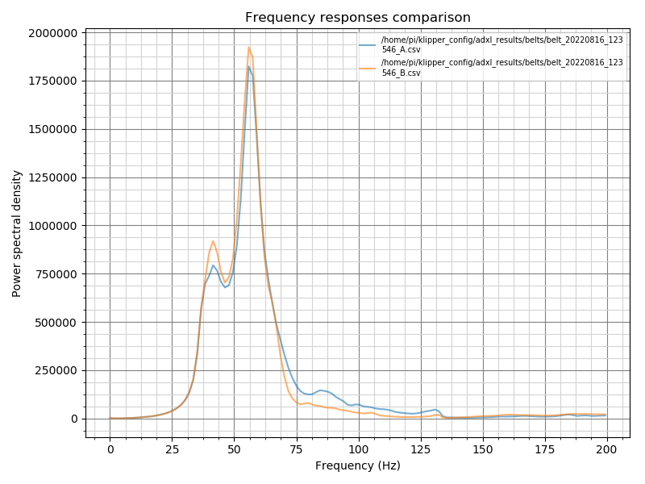
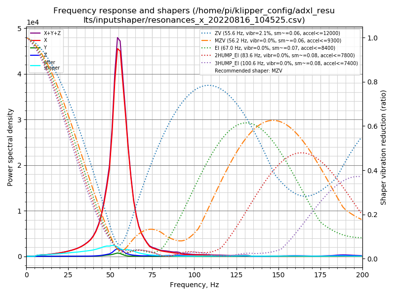
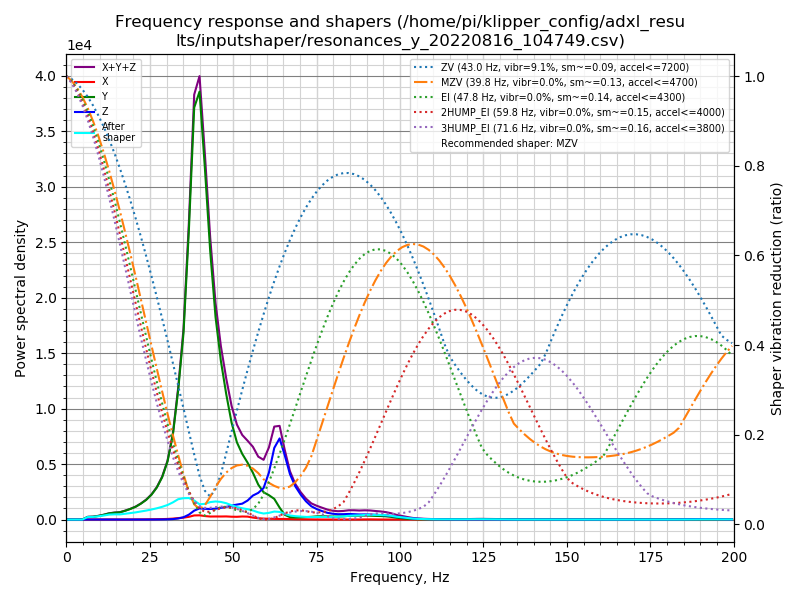

Ersteller und Autor: frix-x https://github.com/Frix-x

Editiert und modifiziert: Fragmon https://github.com/Fragmon

## Beschreibung

Dieser Satz von zwei Makros (und das dazugehörige Bash-Skript) soll Ihnen helfen, die Input-Shaper-Algorithmen von Klipper zu konfigurieren.

  1. Führen Sie die Tests entweder für die zwei Achsen oder die zwei Bänder durch, um das Maschinenverhalten mit dem ADXL345 zu messen. 
  2. Dann wird ein automatisches Bash-Skript aufgerufen, das ein paar Dinge automatisiert:
     1. es generiert die Graphen.
     2. es verschiebt die Graphen und die dazugehörigen csv-Dateien in den [ADXL-Ergebnisordner](./../../adxl_results/).
     3. Es verwaltet den Ordner, um die älteren Dateien zu löschen und nur einen Satz (standardmäßig drei) der neuesten Ergebnisse zu behalten.

Die Ergebnisse befinden sich im [ADXL-Ergebnisordner](./../../adxl_results/), der direkt im Stammverzeichnis des Konfigurationsordners platziert ist, um den Zugriff direkt von Ihrem Browser mit dem Dateimanager FLuidd/Maisail zu ermöglichen. Sie brauchen kein SSH mehr, um Ihren Input Shaper zu kalibrieren!

| Riemenspannung Beispiel | X-Resonanzen Beispiel | Y-Resonanzen Beispiel |
|:----------------------:|:----------------------:|:---------------------:|
|  |  |  |

## Verwendung

Stellen Sie sicher, dass Ihr Rechner gebootet ist und rufen Sie dann eines der folgenden Makros auf:
  - `BELTS_SHAPER_CALIBRATION` um die Bandresonanzkurven zu erhalten. Dies ist nützlich, um die Riemenspannung zu überprüfen, aber auch um festzustellen, ob die Riemenwege in Ordnung sind.
  - `AXES_SHAPER_CALIBRATION`, um die Graphen der Standard-Eingangsformung zu erhalten und die Ringing/Ghosting-Artefakte in Ihren Ausdrucken zu unterdrücken.

Suchen Sie dann die Ergebnisse im Ergebnisordner. Sie können sie direkt in Ihrem Konfigurationsordner finden, indem Sie die WebUI von Mainsail/Fluidd verwenden.

