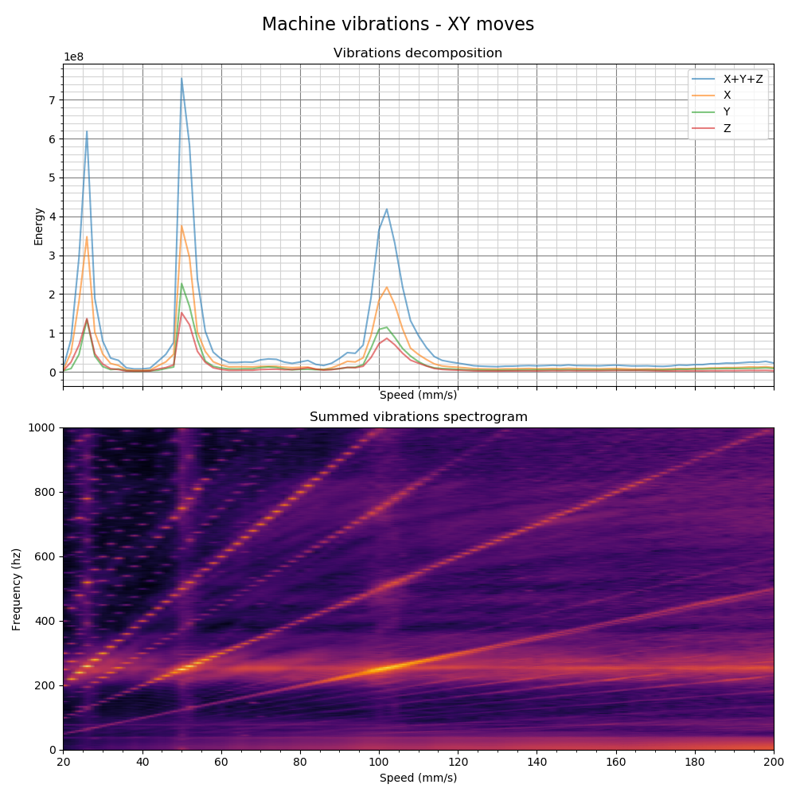

# Vibrationsmessungen
Dieses Makro hilft Ihnen, die Geschwindigkeitseinstellungen zu ermitteln, die die Vibrationen der Maschine verstärken (d. h. wo der Rahmen stark schwingt). Es hilft auch dabei, die sauberen Geschwindigkeitsbereiche zu finden, in denen die Maschine leise ist.

## Beschreibung
Ich hatte starke Vibrationen bei ganz bestimmten Geschwindigkeiten auf meiner Maschine (z. B. 52 mm/s) und wollte all diese problematischen Geschwindigkeiten finden, um sie in meinem Slicer-Profil zu hinterlegen.

Es handelt sich um einen vollautomatischen Arbeitsablauf, der durch die Bewegung des Werkzeugkopfes unter Verwendung des Beschleunigungsmessers funktioniert:
  1. Es wird eine Sequenz von Bewegungen auf der zu messenden Achse mit verschiedenen Geschwindigkeitseinstellungen ausgeführt, während die globalen Maschinenvibrationen mit dem Beschleunigungsmesser aufgezeichnet werden.
  2. Dann wird ein automatisches Bash-Skript aufgerufen, das einige Dinge automatisiert:
     1. Es erzeugt die Schwingungsgrafik für die angegebene Achse mit Hilfe des maßgeschneiderten Python-Skripts.
     2. Es verschiebt dann den Graphen und das zugehörige CSV-Archiv in den [ADXL-Ergebnisordner](./../../adxl_results/).
     3. Es verwaltet den Ordner, um die älteren Dateien zu löschen und nur einen Satz (standardmäßig drei) der neuesten Ergebnisse zu behalten.

Die Ergebnisse können im [ADXL-Ergebnisordner](./../../adxl_results/) gefunden werden, der direkt im Wurzelverzeichnis des Konfigurationsordners platziert ist, um den Zugriff direkt von Ihrem Browser mit dem FLuidd/Maisail-Dateimanager zu ermöglichen. Es wird kein SSH benötigt!

## Verwendung

Zuerst müssen Sie den Inputshaper aktivieren! Dieses Makro sollte nicht vorher verwendet werden, da es nutzlos wäre und die Ergebnisse ungültig wären.

Dann rufen Sie das Makro `VIBRATIONS_CALIBRATION` mit der Richtung und dem Geschwindigkeitsbereich auf, den Sie messen wollen. Hier sind die verfügbaren Parameter:

| Parameter | Standardwert | Beschreibung |
|-----------:|---------------|-------------|
|SIZE|60|Größe in mm des Bereichs, in dem die Bewegungen ausgeführt werden
|DIRECTION|"XY"|Richtungsvektor, in dem Sie die Messungen durchführen möchten. Kann entweder auf "XY", "AB", "ABXY", "A", "B", "X", "Y", "Z"| eingestellt werden.
|Z_HEIGHT|20|z Höhe des Werkzeugkopfes vor dem Start der Bewegungen. Seien Sie vorsichtig, wenn sich Ihr ADXL unter der Düse befindet, erhöhen Sie die Höhe, um einen Absturz des ADXLs auf das Maschinenbett zu vermeiden.
|1 Ob die aktuelle Geschwindigkeit in der Konsole protokolliert werden soll
|MIN_SPEED|20|Mindestgeschwindigkeit des Werkzeugkopfes in mm/s für die Bewegungen
|MAX_SPEED|200|Maximalgeschwindigkeit des Werkzeugkopfes in mm/s für die Bewegungen
|SPEED_INCREMENT|2|Geschwindigkeitsinkremente des Werkzeugkopfes in mm/s zwischen den einzelnen Bewegungen
|TRAVEL_SPEED|200|Geschwindigkeit in mm/s, die für alle Verfahrbewegungen verwendet wird
|ACCEL_CHIP|"adxl345"|Beschleunigungsmesser-Chipname in der Konfiguration

Warten Sie, bis das Skript die Berechnung beendet hat, und suchen Sie die Ergebnisse im Ergebnisordner. Sie können die Ergebnisse auch direkt in Ihrem Config-Ordner finden, wenn Sie die WebUI von Mainsail/Fluidd benutzen.
