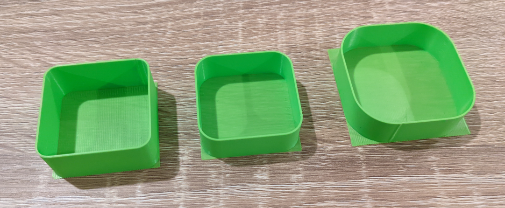

# Flow Calibration

## Beschreibung

Es gibt viele verschiedene Methoden, um den Durchfluss zu messen und zu kalibrieren, aber keine von ihnen ist wirklich konsistent: Meistens sind die Ergebnisse mehrdeutig und offen für Interpretationen und auch immer abhängig vom verwendeten Slicerprofil. Der Hauptgrund für dieses Kalibrierungsmakro ist es, eine filament- und slicerunabhängige Methode zur Kalibrierung des Fließextrusionsmultiplikators mit einfachen Messwerkzeugen zu finden. Das Ziel ist es, es einfach einzustellen, zu teilen und zu benutzen.



Dieses Makro ist parametrisch und die meisten Werte können mit ihren jeweiligen Eingabeparametern angepasst werden. Es arbeitet in zwei Phasen:
  1. Zunächst rufen Sie das Makro `FLOW_MULTIPLIER_CALIBRATION` auf, um eine hohle Schale mit einer bekannten Anzahl von Perimetern auf der Grundlage der [Slic3rPE flow math](https://manual.slic3r.org/advanced/flow-math) zu drucken. Das Makro druckt auch in der Fluidd/Mainsail-Konsole die theoretische Schalendicke, die Sie messen sollten.
  2. Nach Beendigung des Druckvorgangs müssen Sie die durchschnittliche Schalendicke mit einem Mikrometer oder einem guten Messschieber messen und in das zweite Makro `COMPUTE_FLOW_MULTIPLIER MEASURED_THICKNESS=xxx.xxx` eingeben. Der neue kalibrierte Durchfluss wird automatisch in der Fluidd/Mainsail-Konsole ausgedruckt.

## Verwendung

Vergewissern Sie sich zunächst, dass Ihre Achsen ausgerichtet sind und das Bedmesh  geladen ist (falls Sie eines verwenden), Vergessen Sie nicht, QGL, Z-Tilt, Z-Offset richtig einzustellen, ... Im Grunde können Sie Ihren `PRINT_START` manuell aufrufen oder alle erforderlichen Schritte wiederholen.

Dann starten Sie den Druck, indem Sie in der Klipperkonsole (mit Mainsail/Fluidd/Octoprint) den folgenden Makroaufruf eingeben:

```
FLOW_MULTIPLIER_CALIBRATION [mit den benötigten Args...]
```

Die Parameter, die beim Aufruf des Makros `FLOW_MULTIPLIER_CALIBRATION` zur Verfügung stehen, entnehmen Sie bitte dieser Tabelle:

| Parameter | Standardwert | Beschreibung |
|-----------:|---------------|-------------|
|EXTRUDER_TEMP|245|         Drucktemperatur
|BED_TEMP|110|                Druckbetttemperatur
|DO_RAFT|1|                 druckt eine "Basis", um die Schale zu stützen (bessere Bett-Haftung und leichteres Entfernen am Ende)|
|DO_RETRACT|0|              Rückzug aktivieren/deaktivieren. Standardmäßig deaktiviert, um einen konstanten Fluss zu gewährleisten, kann aber bei Problemen mit dem Druck aktiviert werden.
|PRINT_SIZE|40|             Größe in mm, die für den Test auf dem Bett verwendet wird. Das Modell wird in der Mitte des Bettes gedruckt.
|HEIGHT|15|                 Höhe in mm der gedruckten Schale
|CORNER_RADIUS|8|           Außenradius, der in den Ecken der Schale verwendet wird, um die Geschwindigkeit zu glätten und zu versuchen, einen konstanten Fluss über den Druck zu halten.
|PERIMETERS|2|              Anzahl der Perimeter, die zum Drucken der Schale verwendet werden. Wenn 1 Perimeter verwendet wird, ist es zwingend erforderlich, ein Mikrometer zum Messen zu verwenden: am besten ist es, >=2 zu verwenden.
|FAN_SPEED|20|              Prozentualer Anteil des Teillüfters, der für den Druck verwendet werden soll (wird nach dem Rafting eingesetzt)|
|EXTRUSION_MULTIPLIER|1.00| Extrusionsmultiplikator, der auf den Druck angewendet werden soll (verwenden Sie etwas, das dem realen Wert nahe kommt)|
|FILAMENT_DIAMETER|1.75|    Durchmesser des aktuell im Gerät geladenen Filaments
|EXTRUSION_WIDTH|0.4|       Breite einer Extrusionslinie (als Ziel). Die Verwendung von 75-100% des Düsendurchmessers ist ein sicherer Wert.
|LAYER_HEIGHT|0.2|          Schichthöhe des Drucks. Vermeiden Sie einen zu kleinen Wert und versuchen Sie, in der Nähe von 0,5 * Düsendurchmesser zu bleiben.
|CONTROL_SPEED|80|          Vorschubgeschwindigkeit (in mm/s) für den Druck der Schale|
|RAFT_SPEED|60|             Vorschubgeschwindigkeit (in mm/s) für den Druck des Floßes
|TRAVEL_SPEED|200|          Vorschubgeschwindigkeit (in mm/s) für schnelle Fahrbewegungen
|Z_LIFT_SPEED|20|           Vorschub (in mm/s) für Z-Lift-Bewegungen (grundsätzlich Z-Hop und Z-Ausrichtung)|
|RETRACT_SPEED|50|          Vorschub (in mm/s) für Rückzug und Rückzug von Filamenten
|RETRACT_LENGTH|0.5|        Rückzugslänge in mm (verwenden Sie Ihren eigenen Rückzugswert für das Filament)|
|PURGE_MM|1|                Menge des Filaments, um den Druck vor dem Drucken der Hauptlinie zu initiieren (kann 0 sein oder deaktiviert werden)|

Messen Sie schließlich die Dicke der Schale mit einem Messschieber (oder noch besser mit einem Mikrometer) und rufen Sie das Berechnungsmakro mit dem gemessenen Wert auf. Achten Sie darauf, dass Sie zwischen dem Druck und der Messung keinen Neustart des Klippers durchführen, da sonst die gedruckten Schalenwerte gelöscht werden!

```
COMPUTE_FLOW_MULTIPLIER MEASURED_THICKNESS=xxx.xxx
```

Sie sehen den neu berechneten Durchflusswert in der Web-Konsole (in Mainsail/Fluidd/Octoprint) gedruckt. Verwenden Sie ihn in Ihrem bevorzugten Slicer.
